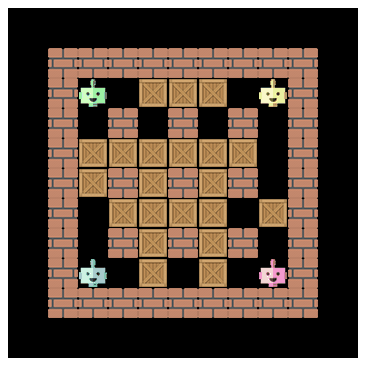

# Q‑Learning with **BombeRLe**

This repository implements both **tabular Q‑learning** and a **Deep Q‑Network (DQN)** for the classic game *Bomberman* using the BombeRLe environment.



---

## Table of contents

* [Project structure](#project-structure)
* [Agents](#agents)

  * [tq\_demonstrator (data recorder)](#tq_demonstrator-data-recorder)
  * [Exploration logic used for data collection](#exploration-logic-used-for-data-collection)
* [Usage](#usage)

  * [Coingrabber](#coingrabber)
  * [Crate‑hero](#crate-hero)
  * [Allstar](#allstar)
* [Training / code layout](#training--code-layout)
* [Tips & notes](#tips--notes)
* [License](#license)
* [Citation](#citation)

---

## Project structure

All **new agents** live under the `agent_code/` directory. A typical layout looks like this (truncated):

```text
.
├── agent_code/
│   ├── peaceful_agent/
│   ├── rule_based_agent/
│   ├── tq_demonstrator/        # NEW: rule_based-derived agent that records transitions
│   ├── tq_coingrabber/
│   ├── tq_cratehero/
│   └── tq_allstar/
├── q_agent_parent.py
├── q_build_training_episodes.py
├── q_deep_agent.py
├── q_optuna.py
├── q_pretrain_tabular.py
├── q_prioritised_experience_replay.py
├── q_tabular_agent.py          # Core tabular Q-learning implementation
├── q_train_tabular.py
└── figures/
```

> **Heads‑up:** paths below assume you run commands from the repo root.

---

## Agents

* **tq\_coingrabber** – agent trained for coin‑heaven scenario.
* **tq\_cratehero** – agent trained for loot‑crate scenario.
* **tq\_allstar** – agent trained on multi‑opponent games.
* **tq\_demonstrator** – **new** helper agent based on `rule_based_agent` that **stores transitions** from every time‑step while it plays. It is used to generate supervised/offline training data for the tabular and DQN pipelines.

### `tq_demonstrator` (data recorder)

Add the following to your agent’s `callbacks.py` to enable per‑time‑step **transition recording**. It creates a unique run folder (e.g. `runs/run_YYYYMMDD_HHMMSS_<id>/`) and appends all game transitions into a compressed pickle stream `transitions_all_games.pkl.gz`.

## Usage

Below are minimal, end‑to‑end scripts to **reproduce the results** shown in the blog post. Adjust paths if your run folders differ.

### Coingrabber

1. **Generate and store raw game data** (dictionary at every time‑step):

```bash
python3 main.py play \
  --agents tq_demonstrator \
  --train 1 --n-rounds 50000 \
  --scenario coin-heaven --no-gui
```

2. **Convert the training data** (tuples of `(states, actions, rewards)`):

```bash
python3 q_build_training_episodes.py agent_code/tq_demonstrator/runs/coin_heaven_50k/
```

3. **Pretrain the agent** on all episodes in 10 batches:

```bash
python3 q_pretrain_tabular.py \
  -i agent_code/tq_demonstrator/runs/coin_heaven_50k/transitions.pkl \
  --training-episodes 5000 --num-chunks 10 \
  -o agent_code/tq_coingrabber/q_table.npz \
  --evaluate --agents tq_coingrabber --scenario coin-heaven
```

4. **Test the agent**:

```bash
python3 main.py play --agents tq_coingrabber --scenario coin-heaven
```

---

### Crate‑hero

1. **Generate and store raw game data**:

```bash
python3 main.py play \
  --agents tq_demonstrator \
  --train 1 --n-rounds 50000 \
  --scenario loot-crate --no-gui
```

2. **Convert the training data**:

```bash
python3 q_build_training_episodes.py agent_code/tq_demonstrator/runs/loot_crate_50k/
```

3. **Pretrain the agent**:

```bash
python3 q_pretrain_tabular.py \
  -i agent_code/tq_demonstrator/runs/loot_crate_50k/transitions.pkl \
  --training-episodes 5000 --num-chunks 10 \
  -o agent_code/tq_cratehero/q_table.npz \
  --evaluate --agents tq_cratehero --scenario loot-crate
```

4. **Test the agent**:

```bash
python3 main.py play --agents tq_cratehero --scenario loot-crate
```

---

### Allstar

1. **Generate and store raw game data** (three opponents: peaceful + two rule‑based):

```bash
python3 main.py play \
  --agents tq_demonstrator peaceful_agent rule_based_agent rule_based_agent \
  --train 1 --n-rounds 50000 --no-gui
```

2. **Convert the training data**:

```bash
python3 q_build_training_episodes.py agent_code/tq_demonstrator/runs/three_rule_based_peaceful_50k/
```

3. **Pretrain the agent** (single dataset):

```bash
python3 q_pretrain_tabular.py \
  --transitions-file agent_code/tq_demonstrator/runs/three_rule_based_peaceful_50k/transitions.pkl \
  -o agent_code/tq_allstar/q_table.npz \
  --training-episodes 5000 --num-chunks 10 \
  --evaluate --agents tq_allstar peaceful_agent rule_based_agent rule_based_agent
```

Or mix several datasets (increase `--num-chunks` accordingly):

```bash
python3 q_pretrain_tabular.py \
  --transitions-file \
    agent_code/tq_demonstrator/runs/coin_heaven_50k/transitions.pkl \
    agent_code/tq_demonstrator/runs/loot_crate_50k/transitions.pkl \
    agent_code/tq_demonstrator/runs/three_rule_based_peaceful_50k/transitions.pkl \
  -o agent_code/tq_allstar/q_table.npz \
  --training-episodes 5000 --num-chunks 30 \
  --evaluate --agents tq_allstar peaceful_agent rule_based_agent rule_based_agent
```

4. **Test the agent**:

```bash
python3 main.py play --agents tq_allstar peaceful_agent rule_based_agent rule_based_agent
```

---

## Training / code layout

The Q‑learning training and utilities are split across the following files:

* `q_tabular_agent.py` – **Tabular Q‑learning core** (Q‑table updates, ε‑greedy policy, etc.).
* `q_train_tabular.py` – Training loop for the tabular agent.
* `q_pretrain_tabular.py` – Offline pre‑training from recorded transitions / episodes.
* `q_deep_agent.py` – DQN implementation.
* `q_prioritised_experience_replay.py` – PER buffer used by DQN.
* `q_agent_parent.py` – Shared functionality / base class for Q‑agents.
* `q_build_training_episodes.py` – Converts raw game dictionaries into `(state, action, reward)` tuples.
* `q_optuna.py` – Hyper‑parameter tuning utilities.

## Tips & notes

* **Run folders:** `tq_demonstrator` writes to `runs/<auto‑generated>/`. You can symlink or copy to scenario‑named folders (e.g. `coin_heaven_50k/`) to keep things tidy.
* **Decaying exploration:** The demonstrator uses ε‑greedy exploration with decay to enrich the dataset at the start of training.
* **Scenarios:** Use `--scenario coin-heaven` or `--scenario loot-crate` to reproduce the experiments.
* **GPU/CPU:** DQN code will use your default device; check `q_deep_agent.py` for toggles.

## License

Add your license here (e.g. MIT).